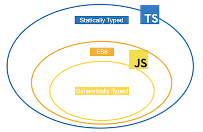

# Intro

> What and Why Typescript??

## 타입스크립트란?

- `TypeScript is JavaScript with syntax for types.`

  > _from official site_

- Typescript는 Javascript의 `superset` 이다.

  > superset이란 subset(부분집합)의 반대말로서 번역하자면 확대집합 등으로 해석되지만 그 자체로 이해하는 편이 좋은듯하다. 아래 다이어그램을 보면 정확히 이해할 수 있다.

  ;

- 브라우저는 자바스크립트만을 이해할 수 있다. 그렇기 때문에 브라우저에서 타입스크립트를 사용하기 위해선 타입스크립트를 자바스크립트로 `컴파일(정확히는 트랜스파일)하는 과정`이 필요하다.

## 타입스크립트의 장점

- 에러의 사전 방지

  자바스크립트는 타입의 오류가 생기는 경우 항상 런타임에서만 해당 오류를 확인할 수 있다. 하지만 타입스크립트는 컴파일 단계에서 빠르게 해당 오류를 확인할 수 있다.

- 코드 가이드

  vscode에서는 타입에 따라 제공하는 API(메소드)를 . 이후에 확인할 수 있다. 그렇기 때문에 개발시 원하는 메소드를 빠르게 찾아서 코딩할 수 있게 된다.(다른 에디터(or IDE)에서는 어떻게 보이는지 확인을 안해봐서 그 부분은 알 수 없다...아마 비슷한 기능을 하지 않을까 생각한다.)

- 위와 같은 요소들로 인해서 개발 생산성이 향상될 수 있다.
