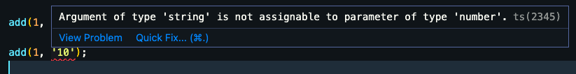
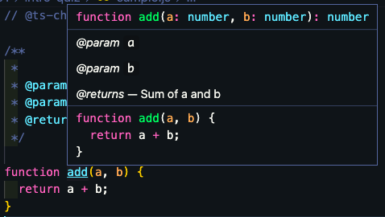
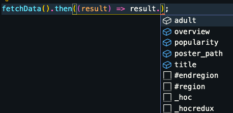
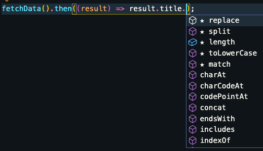

# JS DOC

> 자바스크립트를 타입스크립트처럼 사용하는 방법 : `JS DOC`이용하기

`장점`

- 타입스크립트를 사용하지 않고 자바스크립트 자체에서 타입스크립트를 사용하는 것 `같은` 효과를 낼 수 있다.

`단점`

- 가독성이 떨어진다.

- 문서화하는데 시간이 소모가 크다.

## JS DOC이란?

JS DOC이란 자바스크립트용 API 문서 생성기이다. 쉽게 말해서 자바스크립트 소스 코드에 주석을 다는데 도움을 주는 툴이라고 볼 수 있다. 특정 형식과 포멧을 가지고 있고, 각각의 포멧이 의미를 지니고 있다. 그렇기 때문에 해당 포맷에 맞게 작성해주면 JSDoc파서가 이를 인식하여 정의한대로 문서를 만들어준다. (여기서는 문서화하진않고, 해당 소스코드에서 어떻게 보여지는지에 대해서 알아본다.)

> [링크](https://jsdoc.app/)에 들어가서 좀 더 자세히 알아볼 수 있다.

> 예시를 통해서 어떤 식으로 사용하는지 알아보자.

```js
// @ts-check

/**
 * @param {number} a
 * @param {number} b
 * @returns {number} Sum of a and b
 */

function add(a, b) {
  return a + b;
}

add(1, 10);

add(1, '10'); // #1 error 메세지 발생
```

`@ts-check`를 사용하게 되면 타입스크립트를 사용하지 않더라고 타입스크립트와 같은 효과를 낼 수 있다. 위에 처럼 JS DOC 스타일로 함수를 정의하면 해당 정의에 맞게 함수가 사용되는지 체크를 할 수 있다. 그래서 #1 함수를 실행하면 아래와 같은 에러를 확인할 수 있다.



또한 함수에 커서를 올려놓으면 위에서 정의된 내용을 확인할 수 있다. 즉 함수를 어떻게 사용할지에 대한 내용을 볼 수 있는 것이다. 지금은 같은 파일에 있기 때문에 체감이 안되지만, 파일이 많은 경우 이런 방식을 통하면 굳이 함수를 찾아서 들어가보지 않아도 함수를 어떻게 사용할지에 대해서 빠르게 알 수 있기 때문에 코딩할 때 편한 경우가 있다.



```js
const url = '....'; // 있다고 가정.

/**
 * @typedef {object} Movie
 * @property {string} title
 * @property {string} overview
 * @property {boolean} adult
 * @property {number} popularity
 * @property {string} poster_path
 */

/**
 *
 * @returns {Promise<Movie>}
 */

async function fetchData() {
  return fetch(url).then((res) => res.json());
}

fetchData().then((result) => result.title);
```

위에 처럼 타입을 정의할 수 있다. 해당 객체에 접근하는 경우 정의된 타입에 맞게 속성이 자동완성된다. 또 해당 속성은 타입에 맞는 메소드가 자동완성으로 추천된다. 이러한 과정을 통해서 좀 더 빠르게 코딩하고 실수를 미연에 방지할 수 있다.




<br />

✅ 위의 예시 외에도 많은 옵션들이 존재한다. 중요한 함수들에 한해서 이런 식으로 작성해 주는 것은 괜찮은 방법이라고 생각한다. 뿐만아니라 여러 함수에 대해서 API 문서화하는 것은 협업을 위해서 좋은 방법될 수 있다. 하지만 모든 함수와 모든 타입에 대해서 이런 식으로 정의하는 것은 많은 시간과 자원이 필요하기 때문에 차라리 타입스크립트를 사용하는 것이 더 좋은 대안이라고 생각한다.
