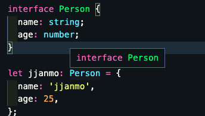
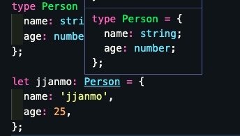

# Type Alias

> 타입 별칭

```ts
type Programmer = {
  name: string;
  knownFor: string[];
  required: string[];
};

const jjanmo: Programmer = {
  name: 'jjanmo',
  knownFor: ['vanilla javascript', 'react'],
  required: ['typescript', 'next'],
};
```

Type Alias vs Interface

```ts
interface Person {
  name: string;
  age: number;
}

type Person = {
  name: string;
  age: number;
};
```

- 타입별칭은 말 그대로 타입에 대한 별칭을 지정한 것이다. 다시 말해 타입 하나를 생성한 것이 아니라 정의한 타입에 대해서 별칭을 부여한 것이다. 반면 인터페이스 자체가 타입을 말한다. 이것은 vs-code의 프리뷰에서 어떻게 보여주는지를 보면 그 차이점을 인식할 수 있다.



> 인터페이스



> 타입 별칭

- 가장 큰 차이점은 인터페이스는 `extends`라는 키워드를 통해서 타입 확장이 가능하지만, 타입 별칭은 타입 확장이 불가능하다는데 있다. 그렇기 때문에 가능하면 타입 별칭보다 인터페이스를 통해서 타입을 선언하는 것을 추천한다고 한다. (공식문서왈!)
